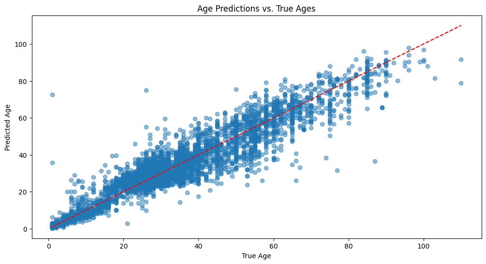
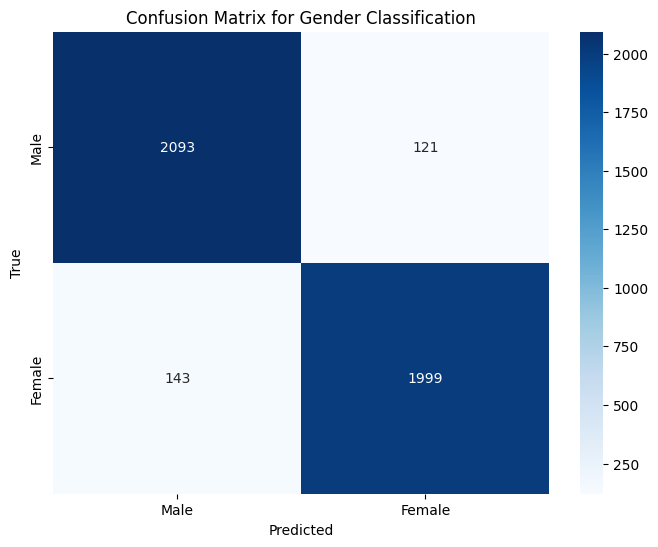
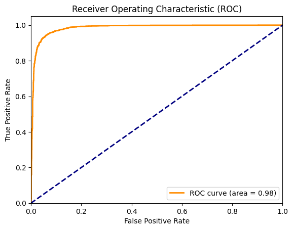

# Age and Gender Prediction

This project utilizes the UTKFace dataset to build a model capable of predicting the age and gender of an individual from their facial image. The dataset comprises over 20,000 images covering a wide range of ages, ethnicities, and genders. The project explores key machine learning concepts including classification tasks, convolutional neural networks (CNN), AI ethics, bias, and model interpretability.

## Concepts Explored

- Classification task
- Convolutional Neural Network (CNN)
- AI ethics and bias
- Model interpretability using LIME

## Project Goals

- Perform exploratory data analysis (EDA), model building, and evaluation.
- Create a single model that returns both age and gender predictions in a single pass.
- Analyze model performance and identify the best and worst performing samples.
- Utilize LIME for model interpretability with images.
- Evaluate ethical issues and potential biases in the model.

## Dataset

The [UTKFace dataset](https://susanqq.github.io/UTKFace/) consists of facial images labeled with age, gender, and ethnicity. The dataset is highly diverse and includes the following attributes:

- **Age:** Range from 0 to 116 years.
- **Gender:** Male (0) and Female (1).
- **Ethnicity:** White (0), Black (1), Asian (2), Indian (3), Others (4).

## Results:

- Age: 4.87 Mean Absolute Error (MAE)



- Gender: 94% F1 Score and confusion matrix


```
Classification Report:
              precision    recall  f1-score   support

        Male       0.94      0.95      0.94      2214
      Female       0.94      0.93      0.94      2142

    accuracy                           0.94      4356
   macro avg       0.94      0.94      0.94      4356
weighted avg       0.94      0.94      0.94      4356
```
- Gender: 98% ROC AUC Score



## Requirements

The project requires the following libraries and tools:

- Python 3.6+
- PyTorch
- OpenCV
- Matplotlib
- Seaborn
- Scikit-learn
- Pandas
- LIME

## Installation

1. Clone the repository:
   ```bash
   git clone https://github.com/yourusername/age-gender-prediction.git
   ```
2. Navigate to the project directory:
   ```bash
   cd age-gender-prediction
   ```
3. Install the required dependencies:
   ```bash
   pip install -r requirements.txt
   ```

## Data Preparation

1. Download the UTKFace dataset from the [official website](https://susanqq.github.io/UTKFace/).
2. Extract the dataset into the `data/utkface_aligned_cropped/UTKFace` directory.
